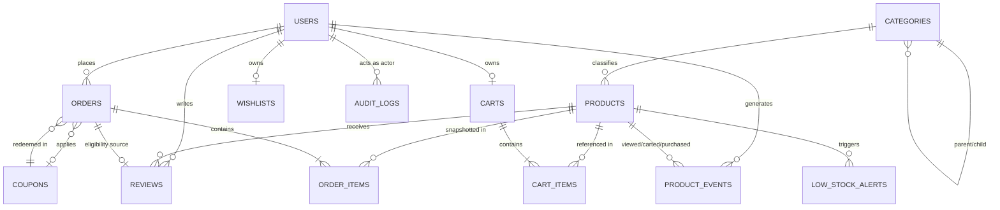

# OptiCart Appliances — Database Structure (MongoDB / Atlas Free Tier)

Source of truth: OptiCart_BRD_v1.0. 11 collections, denormalized where read-frequency demands it, normalized (referenced) where write-consistency/audit demands it.

---

## 1. Data Model Diagram

Relationship semantics:
- `PRODUCTS.categoryId → CATEGORIES._id` (many-to-one)
- `CATEGORIES.parentId → CATEGORIES._id` (self-referencing, nullable = root)
- `CART_ITEMS.productId / variantSku → PRODUCTS` (live reference, price re-validated at checkout)
- `ORDER_ITEMS` embeds a **snapshot** of product name/price/variant at purchase time — never a live join (products mutate, orders must not)
- `REVIEWS.orderId → ORDERS._id` — existence + `status: Delivered` is the verified-purchase gate
- `AUDIT_LOGS.targetEntityId` — polymorphic, resolved via `targetEntityType`

---

## 2. Collections & Relationships Summary

| Collection | Type | Cardinality | Notes |
|---|---|---|---|
| `users` | Core | 1 | Single collection, `role` field discriminates Customer / Inventory Manager / Super Admin. Guest = unauthenticated, no document. |
| `categories` | Core | 1 | Self-referencing tree (parent/child, e.g. Kitchen → Microwaves). |
| `products` | Core | 1 | Variants embedded (bounded array, not independently queried at scale). |
| `carts` | Core | 1:1 with user | Guest cart = client localStorage only, never hits DB. |
| `wishlists` | Core | 1:1 with user | Same guest/customer split as carts. |
| `coupons` | Core | 1 | Standalone; referenced by `code` string in orders, not `_id`, for human-readable audit trail. |
| `orders` | Core | 1:N with user | Items embedded as snapshots. `statusHistory` embedded array = state machine trail. |
| `reviews` | Core | 1 | Compound-unique on `(userId, productId)`. |
| `lowStockAlerts` | Operational | 1 | One active alert per `(productId, variantSku)` at a time. |
| `auditLogs` | Operational | 1 | Append-only, immutable, read-only from app layer. |
| `productEvents` | Analytics | 1 | High-write-volume; feeds recommendation engine aggregation. TTL/archival candidate. |

**Embed vs. reference decision rule applied throughout:** embed when the sub-document is bounded, always read with its parent, and not independently queried (variants, order items, status history). Reference when the entity has independent lifecycle, is queried standalone, or must stay mutation-safe (products, users, coupons).

---

## 3. Collections — Fields & Data Types

### `users`
| Field | Type | Notes |
|---|---|---|
| `_id` | ObjectId | PK |
| `name` | String | |
| `email` | String | unique index |
| `passwordHash` | String | bcrypt |
| `role` | Enum(String) | `customer` \| `inventory_manager` \| `super_admin` |
| `refreshTokenHash` | String | nullable; rotated on refresh |
| `addresses` | Array<Object> | `{ label, line1, line2, city, country, isDefault }` |
| `isActive` | Boolean | Super Admin can deactivate |
| `createdAt` / `updatedAt` | Date | |

### `categories`
| Field | Type | Notes |
|---|---|---|
| `_id` | ObjectId | PK |
| `name` | String | |
| `slug` | String | unique index, SEO |
| `parentId` | ObjectId \| null | ref → `categories._id` |
| `createdAt` | Date | |

### `products`
| Field | Type | Notes |
|---|---|---|
| `_id` | ObjectId | PK |
| `name` | String | |
| `slug` | String | unique index, DB-level enforced |
| `description` | String | |
| `categoryId` | ObjectId | ref → `categories._id`, indexed |
| `basePriceCents` | Int | smallest currency unit |
| `variants` | Array<Object> | `{ sku (unique), color, size, capacity, stock, priceDeltaCents, lowStockThreshold: Int (default 10) }` |
| `images` | Array<Object> | `{ url, publicId }` — Cloudinary `public_id` retained for deletion |
| `ratingAvg` | Float | denormalized, updated on review C/U/D via transaction |
| `reviewCount` | Int | denormalized |
| `isTrending` / `isMostSelling` | Boolean | recalculated via scheduled aggregation pipeline |
| `searchKeywords` | Array<String> | text-index target |
| `meta` | Object | `{ title, description, ogTitle, ogImage, ogDescription }` |
| `createdAt` / `updatedAt` | Date | |

Indexes: `slug` (unique), `categoryId`, text index on `name + searchKeywords`, compound `(categoryId, basePriceCents)` for filtered browse.

### `carts`
| Field | Type | Notes |
|---|---|---|
| `_id` | ObjectId | PK |
| `userId` | ObjectId | ref → `users._id`, unique index (1:1) |
| `items` | Array<Object> | `{ productId, variantSku, quantity, priceAtAddCents }` |
| `updatedAt` | Date | |

### `wishlists`
| Field | Type | Notes |
|---|---|---|
| `_id` | ObjectId | PK |
| `userId` | ObjectId | ref → `users._id`, unique index |
| `productIds` | Array<ObjectId> | ref → `products._id` |

### `coupons`
| Field | Type | Notes |
|---|---|---|
| `_id` | ObjectId | PK |
| `code` | String | unique index, uppercase-normalized |
| `type` | Enum(String) | `percentage` \| `fixed` |
| `value` | Number | |
| `minOrderValueCents` | Int | |
| `expiryDate` | Date | |
| `usageLimit` | Int | global cap |
| `perUserLimit` | Int | |
| `usedBy` | Array<Object> | `{ userId, count }` — enforces per-user limit server-side |
| `isActive` | Boolean | |

### `orders`
| Field | Type | Notes |
|---|---|---|
| `_id` | ObjectId | PK |
| `orderNumber` | String | human-readable, unique index |
| `userId` | ObjectId | ref → `users._id`, indexed |
| `items` | Array<Object> | **snapshot**: `{ productId, name, variantSku, unitPriceCents, quantity }` |
| `subtotalCents` / `discountCents` / `totalCents` | Int | |
| `couponCode` | String \| null | denormalized reference by value, not `_id` |
| `shippingAddress` | Object | snapshot copy from `users.addresses` |
| `status` | Enum(String) | `pending → confirmed → processing → shipped → delivered → [cancelled \| refunded]`, indexed |
| `statusHistory` | Array<Object> | `{ status, timestamp, note }` |
| `paymentIntentId` | String | Stripe reference |
| `paymentStatus` | Enum(String) | `pending \| succeeded \| failed` |
| `refund` | Object \| null | `{ status, reason, approvedBy, approvedAt, stripeRefundId }` |
| `createdAt` / `deliveredAt` / `cancelledAt` | Date | |

Indexes: `orderNumber` (unique), `userId`, `status`, compound `(status, createdAt)` for admin queue queries.

### `reviews`
| Field | Type | Notes |
|---|---|---|
| `_id` | ObjectId | PK |
| `productId` | ObjectId | ref → `products._id`, indexed |
| `userId` | ObjectId | ref → `users._id` |
| `orderId` | ObjectId | ref → `orders._id` — verified-purchase proof |
| `rating` | Int(1–5) | |
| `text` | String | |
| `images` | Array<Object> | `{ url, publicId }` |
| `isFlagged` / `isRemoved` | Boolean | moderation state |
| `createdAt` / `editedAt` | Date | edit window enforced app-side (30 days) |

Index: compound unique `(userId, productId)`.

### `lowStockAlerts`
| Field | Type | Notes |
|---|---|---|
| `_id` | ObjectId | PK |
| `productId` | ObjectId | ref → `products._id`, indexed |
| `variantSku` | String | |
| `thresholdAtTrigger` | Int | |
| `currentStock` | Int | |
| `status` | Enum(String) | `active` \| `resolved` |
| `createdAt` / `resolvedAt` | Date | |

Index: compound `(productId, variantSku, status)` to prevent duplicate active alerts.

### `auditLogs`
| Field | Type | Notes |
|---|---|---|
| `_id` | ObjectId | PK |
| `actorId` | ObjectId | ref → `users._id` |
| `actorName` | String | denormalized (survives actor deactivation) |
| `actionType` | Enum(String) | `stock_update \| order_status_change \| refund_decision \| role_change \| coupon_cud \| review_removal` |
| `targetEntityType` | String | `product \| order \| user \| coupon \| review` |
| `targetEntityId` | ObjectId | polymorphic, resolved via `targetEntityType` |
| `changeDelta` | Object | `{ before, after }` |
| `timestamp` | Date | indexed |

Indexes: `actorId`, `actionType`, `targetEntityId`, `timestamp` (all filterable per BRD §4.11).

### `productEvents` (recommendation engine feed)
| Field | Type | Notes |
|---|---|---|
| `_id` | ObjectId | PK |
| `userId` | ObjectId \| null | null for anonymous (session-scoped, not persisted long-term) |
| `productId` | ObjectId | ref → `products._id` |
| `eventType` | Enum(String) | `view \| cart_add \| purchase` |
| `timestamp` | Date | |

Index: compound `(userId, eventType, timestamp)` for co-purchase aggregation pipeline; consider TTL index (e.g. 180d) to bound collection growth on free-tier 512MB cluster.

---

## Architecture Notes (flag before implementation)

- **`orders.items` must snapshot, never reference live product state** — price/variant mutation post-purchase would otherwise corrupt historical order totals and refund math.
- **Order document created only on Stripe webhook confirmation** (BRD §4.5) — do not create on client-side "checkout initiated"; prevents phantom orders / stock deduction on failed payment.
- **`variants[].sku` uniqueness must be enforced at the application layer** (partial unique index on array elements is not natively supported the way you'd want in MongoDB) — validate on product create/update.
- **`productEvents` is your highest-write-volume collection** on a RAM-constrained free-tier cluster — batch-insert where possible (e.g. buffer view events client-side, flush every N seconds) rather than one write per pageview.
- **`categories` self-reference is currently unbounded depth** — BRD only specifies 2 levels (Kitchen > Microwaves); if depth stays at 2, skip full tree-traversal logic and hardcode parent/child, saving significant implementation complexity.
