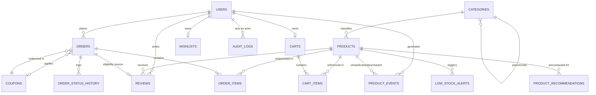

# OptiCart Appliances — Database Structure (Full Spec v4)

Source: OptiCart_BRD_v1.0. v4 changes: delivery-agent role concept fully removed (out of BRD scope, reverted). `statusHistory.updatedBy` gap fix retained (independent of delivery scope — order-status actor attribution is required under the existing 4-role model regardless). `costPriceCents`/`unitCostCents` from v2 retained.

---

## 1. ER Diagram



Relationship semantics:
- `PRODUCTS.categoryId → CATEGORIES._id` (many-to-one)
- `CATEGORIES.parentId → CATEGORIES._id` (self-referencing, 2 levels per BRD — do not build unbounded tree traversal)
- `CART_ITEMS.productId/variantSku → PRODUCTS` (live reference, re-validated at checkout)
- `ORDER_ITEMS` embeds a **snapshot** (name, price, cost, variant) at purchase time — never a live join
- `ORDER_STATUS_HISTORY[].updatedBy → USERS._id` — actor attribution, fixes v2 gap
- `REVIEWS.orderId → ORDERS._id` + `status: Delivered` = verified-purchase gate
- `LOW_STOCK_ALERTS.productId → PRODUCTS._id` — separate collection, not embedded (rationale §3.9)
- `AUDIT_LOGS.targetEntityId` — polymorphic via `targetEntityType`
- `PRODUCT_RECOMMENDATIONS.productId → PRODUCTS._id` — precomputed cache, read path for the recommendation engine

---

## 2. Collections — Semantics, Fields, Relationships

### 3.1 `users`
Single collection, role-discriminated. Guest = no document, session-only.

| Field | Type | Notes |
|---|---|---|
| `_id` | ObjectId | PK |
| `name` | String | |
| `email` | String | unique index |
| `passwordHash` | String | bcrypt |
| `role` | Enum(String) | `customer \| inventory_manager \| super_admin` |
| `refreshTokenHash` | String | nullable, rotated |
| `addresses` | Array<Object> | `{ label, line1, line2, city, country, isDefault }` |
| `isActive` | Boolean | |
| `createdAt` / `updatedAt` | Date | |

**Relations:** `1:N → orders` (`userId`), `1:1 → carts`, `1:1 → wishlists`, `1:N → reviews`, `1:N → auditLogs` (actor), `1:N → productEvents` (subject).

Flat role field, not a separate `roles`/`permissions` collection: RBAC surface is flat (3 roles, no custom permission composition). Add a permissions table only if per-admin custom scopes become a requirement.

---

### 3.2 `categories`
Self-referencing tree, `parentId`. 2 levels observed in BRD (Kitchen → Microwaves).

| Field | Type | Notes |
|---|---|---|
| `_id` | ObjectId | PK |
| `name` | String | |
| `slug` | String | unique index |
| `parentId` | ObjectId \| null | ref → `categories._id` |
| `createdAt` | Date | |

**Relations:** `1:N → products`, `1:N → categories` (self).

---

### 3.3 `products`
Core catalog entity. Variants embedded (bounded, always read with parent → correct to embed).

| Field | Type | Notes |
|---|---|---|
| `_id` | ObjectId | PK |
| `name` | String | |
| `slug` | String | unique index, DB-enforced |
| `description` | String | |
| `categoryId` | ObjectId | ref → `categories._id`, indexed |
| `basePriceCents` | Int | customer-facing price |
| `variants` | Array<Object> | `{ sku (unique), color, size, capacity, stock, priceDeltaCents, costPriceCents, lowStockThreshold: Int (default 10) }` |
| `images` | Array<Object> | `{ url, publicId }` |
| `ratingAvg` | Float | denormalized, updated transactionally |
| `reviewCount` | Int | denormalized |
| `isTrending` / `isMostSelling` | Boolean | scheduled aggregation |
| `searchKeywords` | Array<String> | text-index target |
| `meta` | Object | `{ title, description, ogTitle, ogImage, ogDescription }` |
| `createdAt` / `updatedAt` | Date | |

Indexes: `slug` (unique), `categoryId`, text index (`name + searchKeywords`), compound `(categoryId, basePriceCents)`.

**Relations:** `N:1 → categories`, `1:N → reviews`, `1:N → lowStockAlerts`, `1:N → productEvents`, `1:1 → productRecommendations`; referenced (not owned) by `cart.items` (live) and `order.items` (snapshot).

Denormalized `ratingAvg`/`reviewCount`: read-heavy (every product-list request) vs. write-rare (review C/U/D) — correct tradeoff.

---

### 3.4 `carts` / `wishlists`
1:1 with authenticated user. Guest state = localStorage only, never DB — eliminates orphaned-cart cleanup for anonymous sessions.

| Field | Type | Notes |
|---|---|---|
| `_id` | ObjectId | PK |
| `userId` | ObjectId | ref → `users._id`, unique index |
| `items` | Array<Object> | (carts only) `{ productId, variantSku, quantity, priceAtAddCents }` |
| `productIds` | Array<ObjectId> | (wishlists only) ref → `products._id` |

**Relations:** `1:1 → users`; `items[].productId → products` (live reference — must reflect current price/stock, unlike orders).

Merge-on-login is the only point client-held and DB state reconcile: max(quantity) conflict resolution, server-validated stock recheck on merge.

---

### 3.5 `coupons`
Standalone. Referenced by `code` string, not `_id`, from `orders` — audit logs/support reference human-readable codes.

| Field | Type | Notes |
|---|---|---|
| `_id` | ObjectId | PK |
| `code` | String | unique index, uppercase-normalized |
| `type` | Enum(String) | `percentage \| fixed` |
| `value` | Number | |
| `minOrderValueCents` | Int | |
| `expiryDate` | Date | |
| `usageLimit` | Int | global cap |
| `perUserLimit` | Int | |
| `usedBy` | Array<Object> | `{ userId, count }` — enforces per-user limit without secondary query |
| `isActive` | Boolean | |

**Relations:** `1:N → orders` (value-referenced by `code`, not FK).

---

### 3.6 `orders`
Transactional core. `items[]` snapshots product state at purchase time — never a live reference.

| Field | Type | Notes |
|---|---|---|
| `_id` | ObjectId | PK |
| `orderNumber` | String | unique index |
| `userId` | ObjectId | ref → `users._id`, indexed |
| `items` | Array<Object> | snapshot: `{ productId, name, variantSku, unitPriceCents, unitCostCents, quantity }` |
| `subtotalCents` / `discountCents` / `totalCents` | Int | |
| `couponCode` | String \| null | value-referenced |
| `shippingAddress` | Object | snapshot from `users.addresses` |
| `status` | Enum(String) | `pending→confirmed→processing→shipped→delivered→[cancelled\|refunded]`, indexed |
| `statusHistory` | Array<Object> | `{ status, timestamp, note, updatedBy: ObjectId }` — **`updatedBy` added, fixes v2 gap** |
| `paymentIntentId` | String | Stripe ref |
| `paymentStatus` | Enum(String) | `pending \| succeeded \| failed` |
| `refund` | Object \| null | `{ status, reason, approvedBy, approvedAt, stripeRefundId }` |
| `createdAt` / `deliveredAt` / `cancelledAt` | Date | |

Indexes: `orderNumber` (unique), `userId`, `status`, compound `(status, createdAt)`.

**Relations:** `N:1 → users`, snapshots `products` (no live FK on line items), value-references `coupons`, `1:0..1 → reviews` (verified-purchase gate).

Snapshotting is the single most important modeling decision here: products mutate (price, cost, deletion); orders must not retroactively change, or refund math and historical margin corrupt silently.

Revenue/profit aggregation source (unchanged from v2): revenue = `sum(items.unitPriceCents × quantity)`; gross profit = `sum((items.unitPriceCents − items.unitCostCents) × quantity)`. Both computable directly from this collection.

---

### 3.7 `reviews`
Compound-unique `(userId, productId)` — index-level enforcement, survives concurrent writes (app-level check-then-insert doesn't).

| Field | Type | Notes |
|---|---|---|
| `_id` | ObjectId | PK |
| `productId` | ObjectId | ref → `products._id`, indexed |
| `userId` | ObjectId | ref → `users._id` |
| `orderId` | ObjectId | ref → `orders._id` — verified-purchase proof |
| `rating` | Int(1–5) | |
| `text` | String | |
| `images` | Array<Object> | `{ url, publicId }` |
| `isFlagged` / `isRemoved` | Boolean | |
| `createdAt` / `editedAt` | Date | 30-day edit window, app-enforced |

**Relations:** `N:1 → products`, `N:1 → users`, `N:1 → orders`.

---

### 3.8 `lowStockAlerts`
Separate collection — rejected embedding into `products`.

| Field | Type | Notes |
|---|---|---|
| `_id` | ObjectId | PK |
| `productId` | ObjectId | ref → `products._id`, indexed |
| `variantSku` | String | |
| `thresholdAtTrigger` | Int | |
| `currentStock` | Int | |
| `status` | Enum(String) | `active \| resolved` |
| `createdAt` / `resolvedAt` | Date | |

Index: compound `(productId, variantSku, status)` — prevents duplicate active alerts.

**Relations:** `N:1 → products`.

**Rationale (embed rejected):** BRD §4.9 requires a global cross-product active-alert query — embedding forces a full collection scan to reconstruct that view. Embedding also adds write amplification to `products`, the highest-traffic collection, for zero volume benefit (bounded at 1-active-per-variant, not unbounded). Real free-tier volume risk is `productEvents` (§3.10), not this.

---

### 3.9 `auditLogs`
Append-only, immutable, no update/delete path from app layer.

| Field | Type | Notes |
|---|---|---|
| `_id` | ObjectId | PK |
| `actorId` | ObjectId | ref → `users._id` |
| `actorName` | String | denormalized, survives actor deactivation |
| `actionType` | Enum(String) | `stock_update \| order_status_change \| refund_decision \| role_change \| coupon_cud \| review_removal` |
| `targetEntityType` | String | `product \| order \| user \| coupon \| review` |
| `targetEntityId` | ObjectId | polymorphic, resolved via `targetEntityType` |
| `changeDelta` | Object | `{ before, after }` |
| `timestamp` | Date | indexed |

Indexes: `actorId`, `actionType`, `targetEntityId`, `timestamp`.

**Relations:** `N:1 → users` (actor), polymorphic `N:1 → {products\|orders\|users\|coupons\|reviews}`.

Polymorphic FK over 5 typed nullable FKs or 5 separate log collections: single stream spanning unrelated entity types, resolved app-side — strictly less overhead than either alternative.

---

### 3.10 `productEvents` — Recommendation Engine Feed

Sole data source for BRD §4.7 (co-purchase weighted scoring, recency-weighted, category-trending fallback). Captures discovery path (views before purchase) that `orders` alone doesn't retain.

| Field | Type | Notes |
|---|---|---|
| `_id` | ObjectId | PK |
| `userId` | ObjectId \| null | null = anonymous, session-scoped, not long-lived |
| `productId` | ObjectId | ref → `products._id` |
| `eventType` | Enum(String) | `view \| cart_add \| purchase` |
| `timestamp` | Date | |

Index: compound `(userId, eventType, timestamp)`.

**Relations:** `N:1 → users` (nullable), `N:1 → products`.

**Why separate, not embedded anywhere:** highest write-rate collection in the system by orders of magnitude (every page view = one write). Embedding into `products` (bounded doc) or `users` (unbounded per-user growth, 16MB doc ceiling) is wrong on both ends. Recommendation scoring aggregates *across* users/products for co-occurrence — requires collection-level `$group`, incompatible with data locked in per-entity documents.

**Algorithm mapping** (conceptual pipeline, run on schedule — not per-request):
```js
db.productEvents.aggregate([
  { $match: { eventType: "purchase", userId: { $ne: null } } },
  { $group: { _id: "$userId", products: { $push: { productId: "$productId", ts: "$timestamp" } } } },
  { $unwind: "$products" }
  // self-join within userId's purchase set -> product-pair co-occurrence
  // weight = 1 / (daysSince(ts) + 1)  -- recency decay
  // group by pair, sum weights, sort desc, take top-N
]);
```
Precompute → cache in `productRecommendations` (below) → serve reads from cache. Recomputing per product-page load would be a full aggregation on the largest collection, on every request — unacceptable on a RAM-constrained free cluster.

**Cold-start fallback:** `products.isTrending`/`isMostSelling` (already scheduled-aggregation-derived) — no additional collection needed.

**Mandatory scaling controls** (this is the real crash risk in the schema, not `lowStockAlerts`):
1. TTL index on `timestamp`, ~180d — recency-weighted algorithm already discounts old events, no retention justification beyond that window.
2. Client-side batching for `view` events (buffer + flush every ~10s or on unload); `cart_add`/`purchase` write immediately, naturally low-frequency.
3. Compound `(userId, eventType, timestamp)` index only — do not add a standalone `productId` index unless a specific query requires it; every index taxes write cost on the highest-write-rate collection.

---

### 3.11 `productRecommendations` — Precomputed Cache
Missing from v2; required because `productEvents` is write-only input with no read-optimized output destination.

| Field | Type | Notes |
|---|---|---|
| `_id` | ObjectId | PK |
| `productId` | ObjectId | ref → `products._id`, unique index |
| `recommendedProductIds` | Array<ObjectId> | pre-ranked, top-N, ref → `products._id` |
| `computedAt` | Date | |

**Relations:** `1:1 → products`. Read path for product-detail/cart-page recommendation carousel (BRD §4.7). `productEvents` is never read at request time.

---

## 3. Collections Summary Table

| Collection | Type | Cardinality | Key Relation |
|---|---|---|---|
| `users` | Core | 1 | role-discriminated: customer/inventory_manager/super_admin |
| `categories` | Core | 1 | self-referencing, 2 levels |
| `products` | Core | 1 | N:1 categories |
| `carts` / `wishlists` | Core | 1:1 w/ user | live product refs |
| `coupons` | Core | 1 | value-referenced by orders |
| `orders` | Core | 1:N w/ user | snapshots products |
| `reviews` | Core | 1 | unique (userId, productId) |
| `lowStockAlerts` | Operational | 1 | N:1 products, separate by design |
| `auditLogs` | Operational | 1 | polymorphic actor/target |
| `productEvents` | Analytics | 1 | highest write volume, TTL-bound |
| `productRecommendations` | Analytics | 1:1 w/ product | precomputed cache, read path |

---

## 4. Scope Boundary — Revenue / Profit / Expense

| Metric | Source | Status |
|---|---|---|
| Revenue | `orders.items[].unitPriceCents × quantity` | ✅ In scope, BRD §4.10 |
| Top SKUs / order volume / customer growth | `orders`, `users` | ✅ In scope, BRD §4.10 |
| Gross profit | `orders.items[].(unitPriceCents − unitCostCents) × quantity` | ⚠️ Enabled by schema, not in original BRD §4.10 — confirm before building UI |
| Operating expenses | — | ❌ Out of scope, no transactional data source models this |

---

## 5. Architecture Notes / Risks

- **`orders.items` snapshot (price + cost)** — never reference live product state for historical financials.
- **Order created only on Stripe webhook confirmation** (BRD §4.5) — never on client-side "checkout initiated."
- **`variants[].sku` uniqueness** enforced at application layer — Mongo doesn't natively enforce this within array elements.
- **`productEvents` is the real free-tier scaling risk** — TTL + client-side batching mandatory, not `lowStockAlerts`.
- **`categories` self-reference** — BRD specifies 2 levels, hardcode parent/child, skip tree-traversal logic.
- **`statusHistory.updatedBy`** — order-status changes were unauditable without it under the existing 4-role model. Retained as a standalone fix.
